# Segundo Trabajo de Ingenieria de Software 3 - Introducción a Docker

Este trabajo fue hecho para realizar la segunda asignatura de la materia.

### 4- Desarrollo:

#### 1- Instalar Docker Community Edition

Ya tenía Docker en mi maquina virtual. 

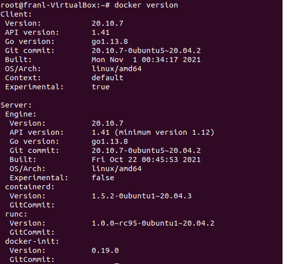

#### 2- Explorar DockerHub
  - Me registré en Dockerhub y me familiarizé con el sitio.
  
  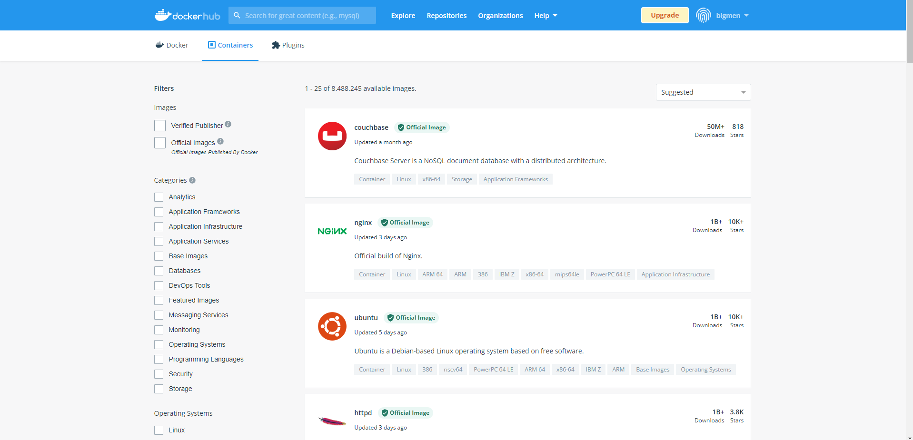
  

#### 3- Obtener la imagen BusyBox
  - Se bajo la imagen BusyBox de Dockerhub
  
  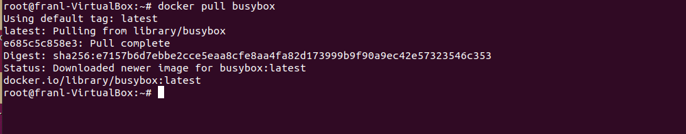
  
  - Y se reviso su peso y version
  
  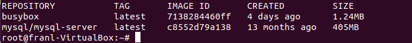

#### 4- Ejecutando contenedores
  - Se corrio docker run busybox  
  No obtenemos ningun resultado, ya que por defecto al correr Busybox solo crea el contenedor, ejecuta la shell de linux y al no tener ningun otro comando sale sin hacer nada mas. 
  - Al realizar docker run busybox echo "Hola Mundo!" si obtenemos un resultado, ya que ejecuta el comando que le pasamos.
  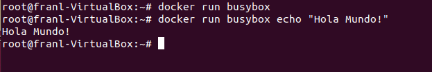
  - Al realizar docker ps no obtenemos nada, porque no hay contenedores en ejecución. Al realizar docker ps -a, se listan todos loq contenedores aunque no esten en ejecucion actual.
  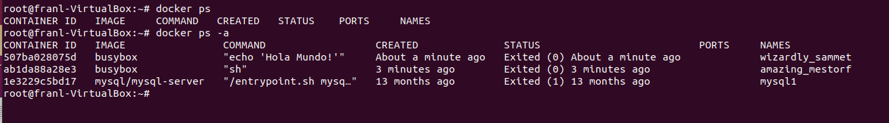
  

#### 5- Ejecutando en modo interactivo
  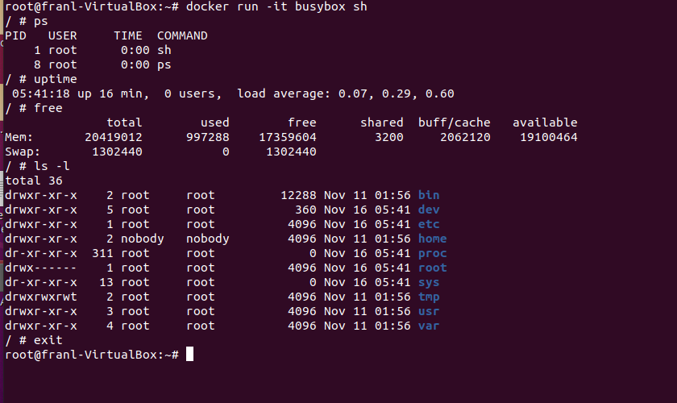

#### 6- Borrando contendores terminados
  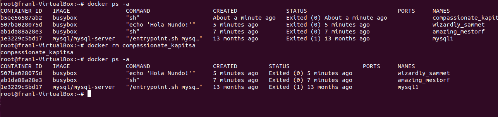
  
  No se ejecuto docker prune a fin de no borrar otro docker si utilizado, una base de mysql.

#### 7- Montando volúmenes

 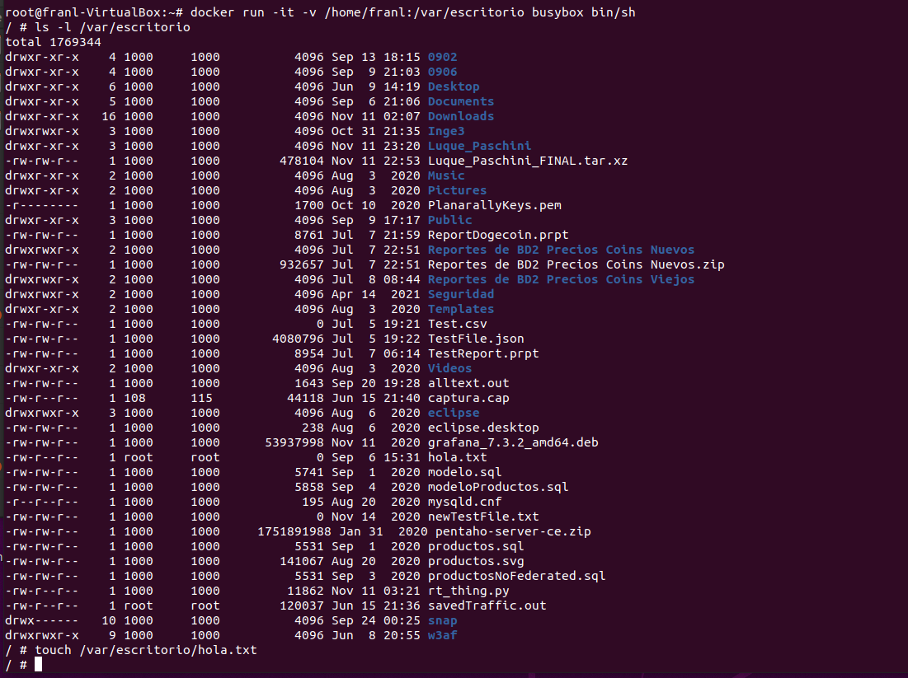
 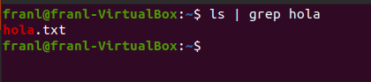
 
 
#### 8- Publicando puertos

 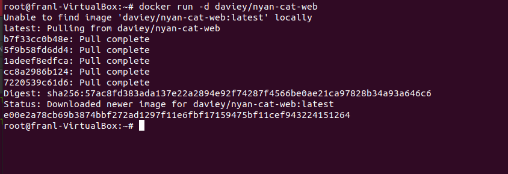
 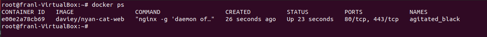
 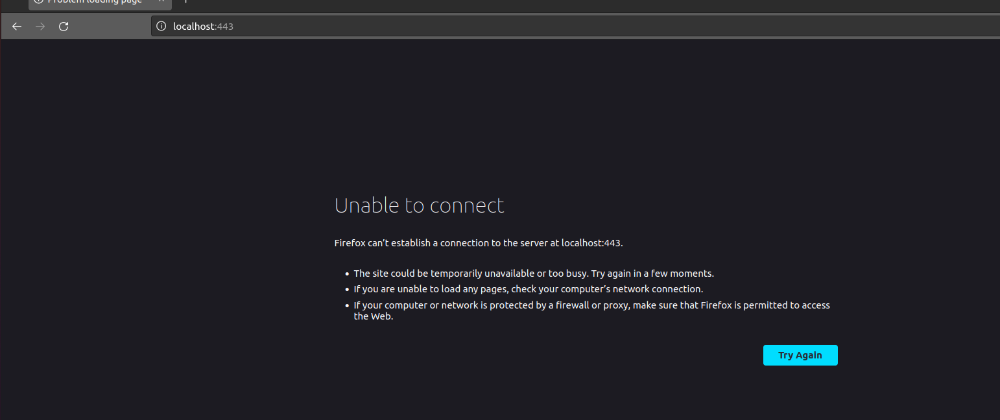
 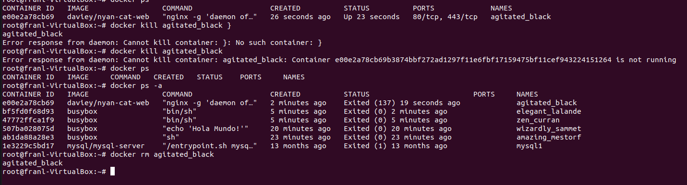
 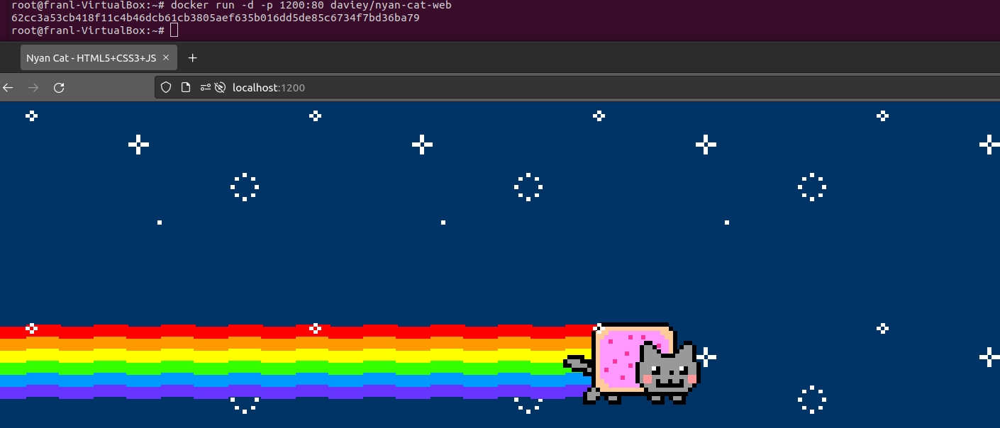
 
#### 9- Utilizando una base de datos
 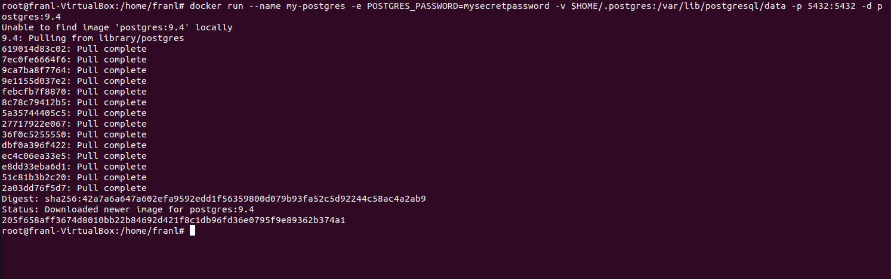
 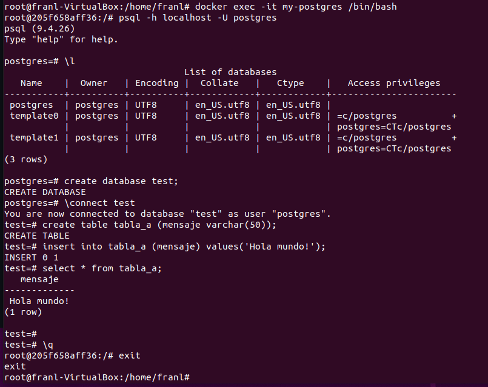
 
 Con el Docker Run creamos un contenedor nuevo. Docker Exec nos permite ejecutar comandos en un contenedor que ya este corriendo.