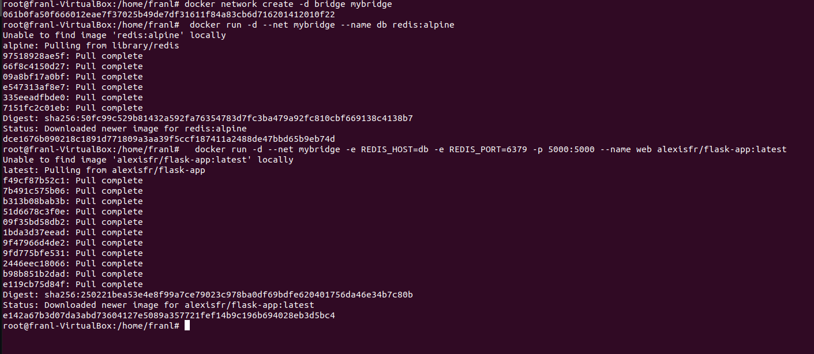
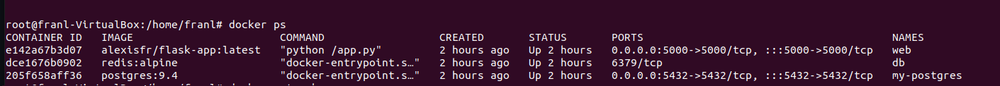
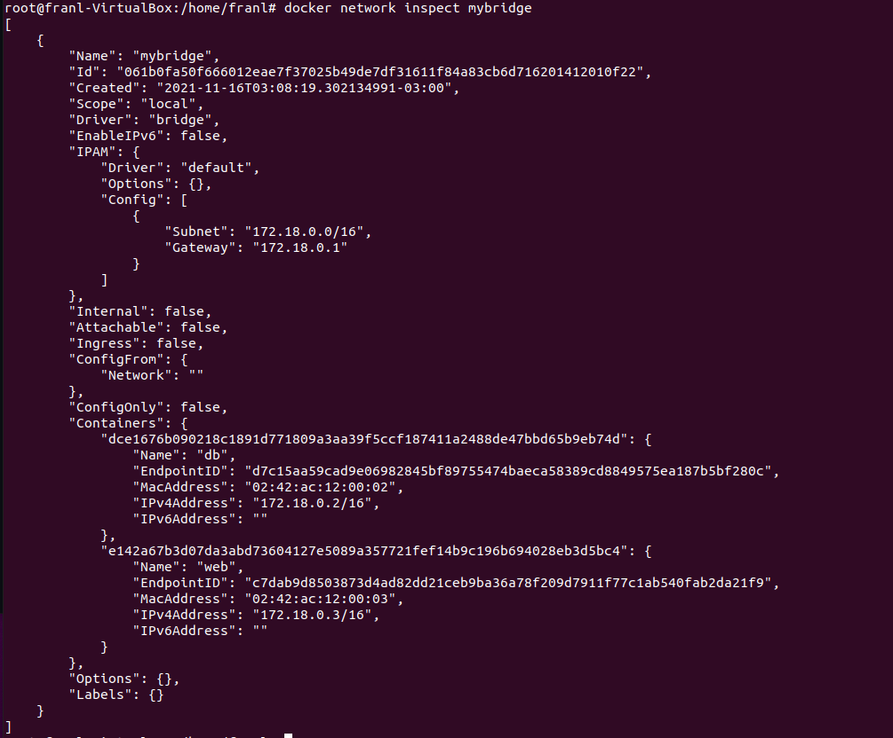
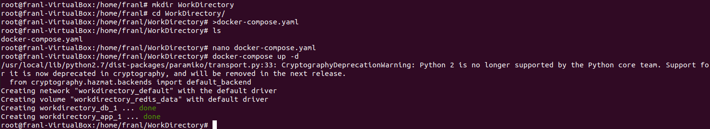
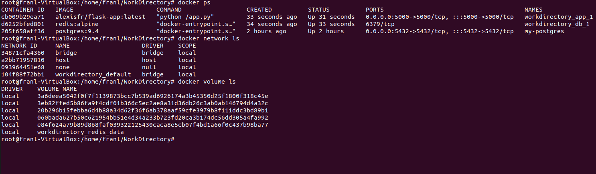
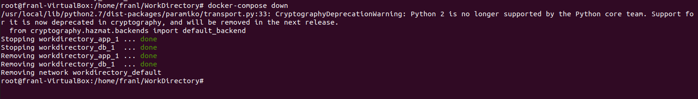
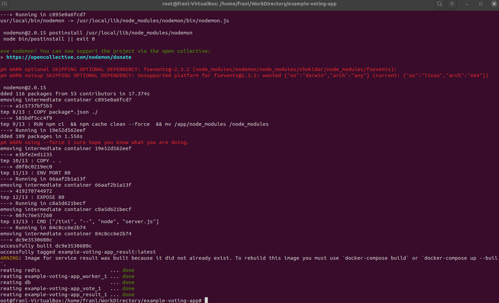
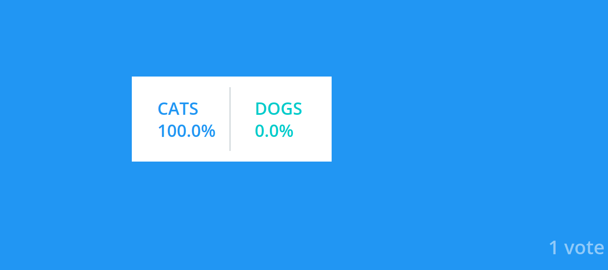

# Tercer Trabajo de Ingenieria de Software 3 - Arquitectura de Sistemas Distribuidos

Este trabajo fue hecho para realizar la tercera asignatura de la materia.


#### 1- Sistema distribuido simple 
  - Ejecutar el siguiente comando para crear una red en docker
  ```bash
  docker network create -d bridge mybridge
  ```
  - Instanciar una base de datos Redis conectada a esa Red.
  ```bash
   docker run -d --net mybridge --name db redis:alpine
   ```
  - Levantar una aplicacion web, que utilice esta base de datos
  ```bash
    docker run -d --net mybridge -e REDIS_HOST=db -e REDIS_PORT=6379 -p 5000:5000 --name web alexisfr/flask-app:latest
  ```
  - Abrir un navegador y acceder a la URL: http://localhost:5000/
  
  

  - Verificar el estado de los contenedores y redes en Docker, describir:
    - ¿Cuáles puertos están abiertos?
    - Mostrar detalles de la red `mybridge` con Docker.
    - ¿Qué comandos utilizó?

  

  

docker ps y docker network inspect
#### 2- Análisis del sistema 
  - Siendo el código de la aplicación web el siguiente:
```python
import os

from flask import Flask
from redis import Redis


app = Flask(__name__)
redis = Redis(host=os.environ['REDIS_HOST'], port=os.environ['REDIS_PORT'])
bind_port = int(os.environ['BIND_PORT'])


@app.route('/')
def hello():
    redis.incr('hits')
    total_hits = redis.get('hits').decode()
    return f'Hello from Redis! I have been seen {total_hits} times.'


if __name__ == "__main__":
    app.run(host="0.0.0.0", debug=True, port=bind_port)
```
  - Explicar cómo funciona el sistema
  
  Cuando creamos el contenedor agarramos las variables de entorno de REDIS_HOST, REDIS_PORT y BIND_PORT. Al abrirse la aplicación se incrementa un contador en redis, que despues se lee para mostrar la cantidad de veces que se ha abierto el sitio.
  
  - ¿Para qué se sirven y porque están los parámetros `-e` en el segundo Docker run del ejercicio 1?
  
  Los parametros -e son nuestros parametros de entorno.
  
  
  - ¿Qué pasa si ejecuta `docker rm -f web` y vuelve a correr ` docker run -d --net mybridge -e REDIS_HOST=db -e REDIS_PORT=6379 -p 5000:5000 --name web alexisfr/flask-app:latest` ?
 Si borramos el contenedor de web no perdemos los hits, ya que estan en db.
 
  - ¿Qué occure en la página web cuando borro el contenedor de Redis con `docker rm -f db`?
  
  Ahi si perdemos el numero de hits.
  - Y si lo levanto nuevamente con `docker run -d --net mybridge --name db redis:alpine` ?
  - ¿Qué considera usted que haría falta para no perder la cuenta de las visitas?
  - Para eliminar los elementos creados corremos:
  ```bash
  docker rm -f db
  docker rm -f web
  docker network rm mybridge
  ```
  
#### 3- Utilizando docker compose 
  - Normalmente viene como parte de la solucion cuando se instaló Docker
  - De ser necesario instalarlo hay que ejecutar:
  ```bash
  sudo pip install docker-compose
  ```
  - Crear el siguente archivo `docker-compose.yaml` en un directorio de trabajo:

```yaml
version: '3.6'
services:
  app:
    image: alexisfr/flask-app:latest
    depends_on:
      - db
    environment:
      - REDIS_HOST=db
      - REDIS_PORT=6379
    ports:
      - "5000:5000"
  db:
    image: redis:alpine
    volumes:
      - redis_data:/data
volumes:
  redis_data:
```

  - Ejecutar `docker-compose up -d`
  
   

  - Acceder a la url http://localhost:5000/
  - Ejecutar `docker ps`, `docker network ls` y `docker volume ls`
  
  - ¿Qué hizo **Docker Compose** por nosotros? Explicar con detalle.
  
  Docker compose creo contenedores interconectados al seguir las instrucciones del docker compose.yaml .
  - Desde el directorio donde se encuentra el archivo `docker-compose.yaml` ejecutar:
  ```bash
  docker-compose down
  ```
  
  
  
 
#### 4- Aumentando la complejidad, análisis de otro sistema distribuido.
Este es un sistema compuesto por:

- Una aplicación web de Python que te permite votar entre dos opciones
- Una cola de Redis que recolecta nuevos votos
- Un trabajador .NET o Java que consume votos y los almacena en...
- Una base de datos de Postgres respaldada por un volumen de Docker
- Una aplicación web Node.js que muestra los resultados de la votación en tiempo real.

Pasos:
- Clonar el repositorio https://github.com/dockersamples/example-voting-app
- Abrir una línea de comandos y ejecutar
```bash
cd example-voting-app
docker-compose -f docker-compose-javaworker.yml up -d
```

  
  
- Una vez terminado acceder a http://localhost:5000/ y http://localhost:5001
- Emitir un voto y ver el resultado en tiempo real.

  
- Para emitir más votos, abrir varios navegadores diferentes para poder hacerlo
- Explicar como está configurado el sistema, puertos, volumenes componenetes involucrados, utilizar el Docker compose como guía.

El sistema esta configurado por 5 microservicios, Vote, Redis, Worker, DB y Results. Vote se encarga de definir nuestro voter id,loguear cuando votamos y pasar esa informacion mediante un POST a Redis.

Redis es un pasamano entre Vote y el Worker.

Worker procesa la información que viene entrando de redis para meterla en la base de datos

DB es la base de datos

Results mira la base de datos, lee y usa la información para mostrar el resultado.

#### 5- Análisis detallado
- Exponer más puertos para ver la configuración de Redis, y las tablas de PostgreSQL con alguna IDE como dbeaver.
- Revisar el código de la aplicación Python `example-voting-app\vote\app.py` para ver como envía votos a Redis.
- Revisar el código del worker `example-voting-app\worker\src\main\java\worker\Worker.java` para entender como procesa los datos.
- Revisar el código de la aplicacion que muestra los resultados `example-voting-app\result\server.js` para entender como muestra los valores.
- Escribir un documento de arquitectura sencillo, pero con un nivel de detalle moderado, que incluya algunos diagramas de bloques, de sequencia, etc y descripciones de los distintos componentes involucrados es este sistema y como interactuan entre sí.

### Presentación del trabajo práctico 3

La presentación de este práctico forma parte del trabajo integrador, especialemente el último punto con el analisis del sistema, todos los documentos e imagenes pueden ser subidos a una carpeta trabajo-practico-03 con las salidas de los comandos utilizados, explicaciones y respuestas a las preguntas.