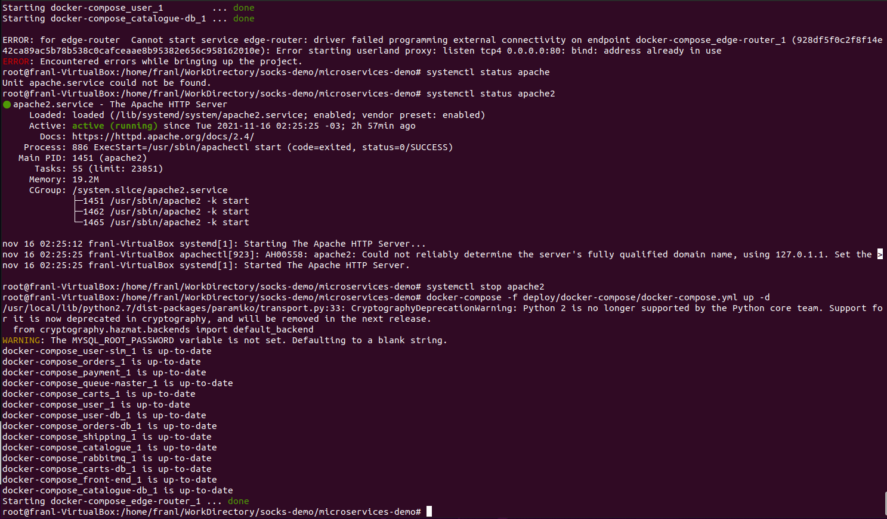
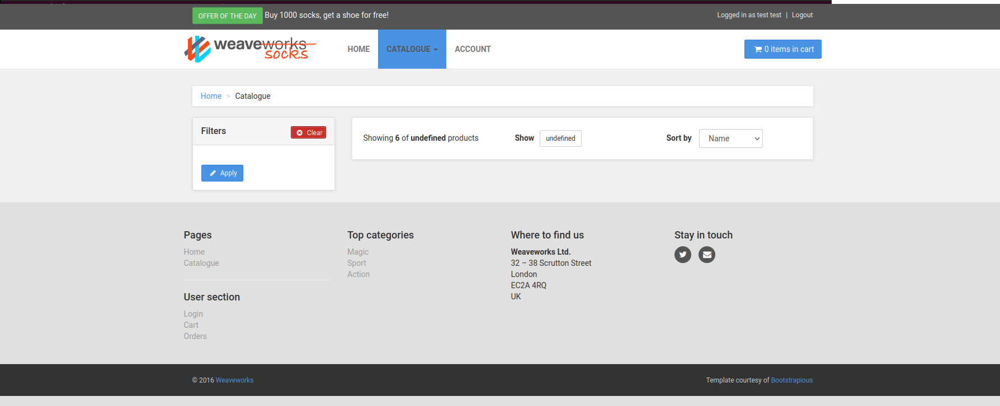

## Trabajo Práctico 4 - Arquitectura de Microservicios

### 1- Objetivos de Aprendizaje
 - Familiarizarse con conceptos de Microservicios

## 4- Desarrollo:


#### 1- Instanciación del sistema
- Clonar el repositorio https://github.com/microservices-demo/microservices-demo
```bash
mkdir -p socks-demo
cd socks-demo
git clone https://github.com/microservices-demo/microservices-demo.git
```
- Ejecutar lo siguiente
```bash
cd microservices-demo
docker-compose -f deploy/docker-compose/docker-compose.yml up -d
```

 
- Una vez terminado el comando `docker-compose` acceder a http://localhost
- Generar un usuario
- Realizar búsquedas por tipo de media, color, etc.
- Hacer una compra - poner datos falsos de tarjeta de crédito ;)

 
#### 2- Investigación de los componentes
1. Describa los contenedores creados, indicando cuales son los puntos de ingreso del sistema

Tenemos los siguientes contenedores: User, Catalogue, rabbitmq, user-db, mongo, queue-master, payment, Catalogue-db, orders, shipping, edge-router, front-end y carts.


Los puntos de ingreso al sistema son edge router y front end.  
2. Clonar algunos de los repositorios con el código de las aplicaciones
```bash
cd socks-demo
git clone https://github.com/microservices-demo/front-end.git
git clone https://github.com/microservices-demo/user.git
git clone https://github.com/microservices-demo/edge-router.git
.
.
```
3. ¿Por qué cree usted que se está utilizando repositorios separados para el código y/o la configuración del sistema? Explique puntos a favor y en contra.

Ya se esta aplicación usa el patrón de microservicios. Esto es una herramienta poderosa ya que nos permite separar el funcionamiento del sistema en multiples servicios independientes que se comunican entre sí.

Esto nos tiene beneficios a la hora de desarollar, pues se pueden desarollar varios servicios a la vez de forma independiente integrando despues. Pero nos puede resultar en complejidad agregada frente a una arquitectura mas tradicional.

4. ¿Cuál contenedor hace las veces de API Gateway?

edge-router

5. Cuando ejecuto este comando:
```bash
curl http://localhost/customers
```
6. ¿Cuál de todos los servicios está procesando la operación?

User

7. ¿Y para los siguientes casos?
```bash
curl http://localhost/catalogue
curl http://localhost/tags
```


8. ¿Como perisisten los datos los servicios?

Mediante los contenedores de las bases de datos.

9. ¿Cuál es el componente encargado del procesamiento de la cola de mensajes?

Queue-master

10. ¿Qué tipo de interfaz utilizan estos microservicios para comunicarse?

Utilizan apis coordinadas por rabbitmq