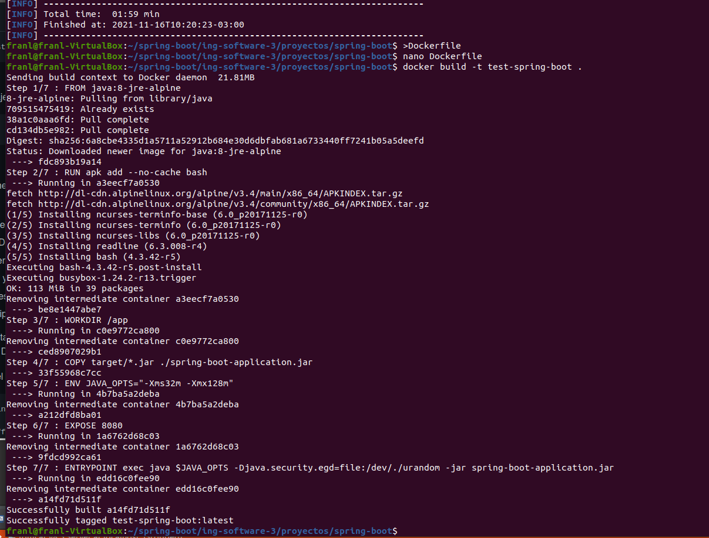

## Trabajo Práctico 6 - Construcción de Imágenes de Docker

### 1- Objetivos de Aprendizaje
 - Adquirir conocimientos para construir y publicar imágenes de Docker.
 - Familiarizarse con el vocabulario.

### 2- Unidad temática que incluye este trabajo práctico
Este trabajo práctico corresponde a la unidad Nº: 3

### 3- Consignas a desarrollar en el trabajo práctico:
 - En los puntos en los que se pida alguna descripción, realizarlo de la manera más clara posible.

### 4- Desarrollo:

#### 1- Conceptos de Dockerfiles
  - Leer https://docs.docker.com/engine/reference/builder/ (tiempo estimado 2 horas)
  - Describir las instrucciones
     - FROM: Nos dice que imagen vamos a usar como base del contenedor.
     - RUN: ejecutar un comando en un shell.
     - ADD: Copiar archivos desde una url o dirección.
     - COPY: copiar archivos de una fuente a un destino.
     - EXPOSE: Escuchar en un puerto.
     - CMD: Ejecutar un comando dentro del contenedor.
     - ENTRYPOINT: Configurar que pasa cuando el contenedor se ejecuta como un ejecutable (?)

#### 2- Generar imagen de docker
   - Clonar/Actualizar el repositorio de https://github.com/alexisfr/ing-software-3
   - El código se encuentra en la carpeta `./proyectos/spring-boot`
   - Se puede copiar al repositorio personal en una carpeta `trabajo-practico-06/spring-boot`
   - Compilar la salida con:
```bash
cd proyectos/spring-boot
mvn clean package spring-boot:repackage  
```
   - Agregar un archivo llamado **Dockerfile** (en el directorio donde se corrió el comando mvn)
```Dockerfile
FROM java:8-jre-alpine

RUN apk add --no-cache bash

WORKDIR /app

COPY target/*.jar ./spring-boot-application.jar

ENV JAVA_OPTS="-Xms32m -Xmx128m"
EXPOSE 8080

ENTRYPOINT exec java $JAVA_OPTS -Djava.security.egd=file:/dev/./urandom -jar spring-boot-application.jar
```
   - Generar la imagen de docker con el comando build
```bash
docker build -t test-spring-boot .
```


 
  - Ejecutar el contenedor
```bash
docker run -p 8080:8080 test-spring-boot
```
  - Capturar y mostrar la salida.
   
  - Verificar si retorna un mensaje (correr en otro terminal o browser)
```bash
curl -v localhost:8080
```


#### 3- Dockerfiles Multi Etapas
Se recomienda crear compilaciones de varias etapas para todas las aplicaciones (incluso las heredadas). En resumen, las compilaciones de múltiples etapas:

- Son independientes y auto descriptibles
- Resultan en una imagen de Docker muy pequeña
- Puede ser construido fácilmente por todas las partes interesadas del proyecto (incluso los no desarrolladores)
- Son muy fáciles de entender y mantener.
- No requiere un entorno de desarrollo (aparte del código fuente en sí)
- Se puede empaquetar con pipelines muy simples

Las compilaciones de múltiples etapas también son esenciales en organizaciones que emplean múltiples lenguajes de programación. La facilidad de crear una imagen de Docker por cualquier persona sin la necesidad de JDK / Node / Python / etc. no puede ser sobrestimado.

- Modificar el dockerfile para el proyecto Java anterior de la siguiente forma
```dockerfile
FROM maven:3.5.2-jdk-8-alpine AS MAVEN_TOOL_CHAIN
COPY pom.xml /tmp/
RUN mvn -B dependency:go-offline -f /tmp/pom.xml -s /usr/share/maven/ref/settings-docker.xml
COPY src /tmp/src/
WORKDIR /tmp/
RUN mvn -B -s /usr/share/maven/ref/settings-docker.xml package

FROM java:8-jre-alpine

EXPOSE 8080

RUN mkdir /app
COPY --from=MAVEN_TOOL_CHAIN /tmp/target/*.jar /app/spring-boot-application.jar

ENV JAVA_OPTS="-Xms32m -Xmx128m"

ENTRYPOINT exec java $JAVA_OPTS -Djava.security.egd=file:/dev/./urandom -jar /app/spring-boot-application.jar

HEALTHCHECK --interval=1m --timeout=3s CMD wget -q -T 3 -s http://localhost:8080/actuator/health/ || exit 1
```
- Construir nuevamente la imagen
```bash
docker build -t test-spring-boot .
```
- Analizar y explicar el nuevo Dockerfile, incluyendo las nuevas instrucciones.

Traemos la imagen del java development kit 8 de maven, copiando el nuevo pom en temp. Ahi corremos mvn para las dependencias, utilizando el pom copiado segun la configuracion de settings.

Luego copiamos el source, y establecemos el directorio principal en tmp.

Corremos y empaquetamos el proyecto.

Posteriormente, tomamos el run enviroment de java 8, escuchando en el puerto 8080, ahí creamos una nueva carpeta y copiamos del jdk el jar a la aplicación.

Seteamos ciertas opciones de memoria de java y establecemos su entry point.

Finalmente con healthcheck revisamos el funcionamiento del container. 

 

#### 4- Python Flask
  - Utilizar el código que se encuentra en la carpeta `./proyectos/python-flask`
  - Se puede copiar al repositorio personal en una carpeta `trabajo-practico-06/python-flask`
  - Correr el comando
```bash
cd ./proyectos/python-flask
docker-compose up -d
```
  - Explicar que sucedió!
  
  Crea el contenedor, y lo manda al fondo al estar detatched, por lo que no ocupa la consola.
  
   
  - ¿Para qué está la key `build.context` en el docker-compose.yml?
  
  

#### 5- Imagen para aplicación web en Nodejs
  - Crear una la carpeta `trabajo-practico-06/nodejs-docker`
  - Generar un proyecto siguiendo los pasos descriptos en el trabajo práctico 5 para Nodejs
  - Escribir un Dockerfile para ejecutar la aplicación web localizada en ese directorio
    - Idealmente que sea multistage, con una imagen de build y otra de producción.
    - Usar como imagen base **node:13.12.0-alpine**
    - Ejecutar **npm install** dentro durante el build.
    - Exponer el puerto 3000
  - Hacer un build de la imagen, nombrar la imagen **test-node**.
  - Ejecutar la imagen **test-node** publicando el puerto 3000.
  - Verificar en http://localhost:3000 que la aplicación está funcionando.
  
  
  - Proveer el Dockerfile y los comandos ejecutados como resultado de este ejercicio.

#### 6- Publicar la imagen en Docker Hub.
  - Crear una cuenta en Docker Hub si no se dispone de una.
  - Registrase localmente a la cuenta de Docker Hub:
```bash
docker login
```
  - Crear un tag de la imagen generada en el ejercicio 3. Reemplazar <mi_usuario> por el creado en el punto anterior.
```bash
docker tag test-node <mi_usuario>/test-node:latest
```
  - Subir la imagen a Docker Hub con el comando
```bash
docker push <mi_usuario>/test-node:latest
``` 
  - Como resultado de este ejercicio mostrar la salida de consola, o una captura de pantalla de la imagen disponible en Docker Hub.
  
  
